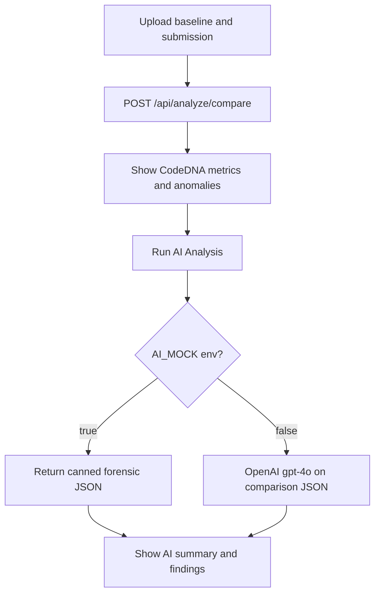

# On-demand AI forensic analysis

The backend split is already in the uncommitted work: [`backend/main.py`](backend/main.py) `/api/analyze/compare` is **local-only** and persists `deterministic_results.json`; `/api/analyze/ai-report` is a **separate** OpenAI (or mock) step. The gap is the UI still treats compare as if it returned `forensic_report`, and it never calls the AI endpoint. Mock is currently a Form field; you asked for **env-only**.

## 1. Backend: env-controlled mock, no auto OpenAI

**Keep** [`generate_forensic_report`](backend/ai_engine.py) and `/api/analyze/ai-report`. Change how mock is chosen:

- Read `AI_MOCK` (e.g. `true`/`1`) from the environment in [`backend/ai_engine.py`](backend/ai_engine.py). Treat a missing or placeholder `OPENAI_API_KEY` as mock as well so a bad key never hits the API during local loops.
- Drop the request `mock` Form flag (or ignore it) so the UI cannot accidentally force a live call.
- Return `ai_mode: "mock" | "openai"` on the AI-report response so the results page can show a small “Mock AI” vs “OpenAI” label (display only, not a toggle).
- Lazy-init the OpenAI client only when a real call is about to run.
- Keep sending **only** the structured comparison dict (never zip/repo contents), matching the TRD.

[`/api/analyze/compare`](backend/main.py) stays as-is: build DNA, `compare_codedna`, save `deterministic_results.json`, return `deterministic_data` only.

Optional small correctness fix in [`backend/analysis.py`](backend/analysis.py) line 87: `dna.languages.get` should be `dna["languages"].get` (local analysis currently under-counts Python files).

Document `AI_MOCK=true` in [`backend/.env`](backend/.env) (and a comment). For the demo, set `AI_MOCK=false` and a real key; click the button a few times only.

## 2. Frontend: local results first, then an explicit AI button

Update [`frontend/src/app/page.tsx`](frontend/src/app/page.tsx):

**Session bug (required for the AI step to work):** `startAnalysis` currently calls `/api/session/start` but **ignores** the returned `session_id` and uses a client UUID. Uploads then 404. Persist `session_id` from the start response in React state and reuse it for compare + AI.

**Compare flow:** After compare succeeds, stay on results with `deterministic_data` only. Copy should say CodeDNA comparison, not “generating forensic report.”

**Results UI:**
- Always show baseline reliability, radar/metrics, and a **local anomalies** list from `deterministic_data.anomalies` (complexity jump, size jump, new libraries). That is the free, every-run output.
- Replace the always-on “AI Conclusion” block with:
  - Empty state: “AI forensic reasoning has not been run.”
  - **Run AI Analysis** button → `POST /api/analyze/ai-report` with the stored `session_id`.
  - Loading state only for this step.
  - Then the existing summary + findings cards from `forensic_report`.
- Button disabled if compare never succeeded. No automatic AI on analyze.
- Optional: disable the button after a successful live/mock report in that session (or leave it re-runnable; mock is free, live should be used sparingly). Prefer **allow re-run** but keep the control explicit.

No mock toggle in the UI.

## 3. What you can test vs demo

- **Dev:** `AI_MOCK=true`. Run Begin Forensic Analysis as many times as you want (local only). Click Run AI Analysis to exercise the report UI with the canned JSON already in `generate_forensic_report(..., mock=True)`.
- **Demo:** `AI_MOCK=false` + real key. Same UI; only the button spends quota.

## Out of scope

VivaGuard, extra forensic engines, and sending full source to OpenAI stay out of this change.
