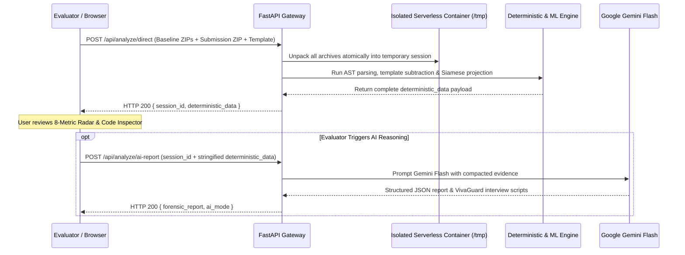
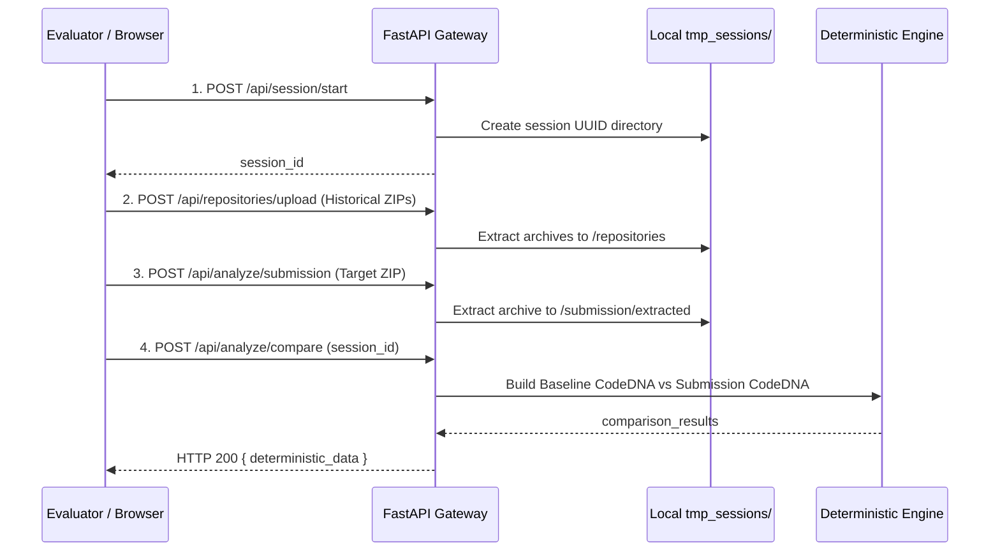

# CodeDNA — System Architecture Specification

> **Document Version:** 2.0  
> **Status:** Production / Evaluator-Ready  
> **Primary Entry Point:** [../README.md](../README.md)  
> **Related Documents:** [PRD.md](PRD.md) | [TRD.md](TRD.md) | [explainer.md](explainer.md)

---

## 1. System Context Diagram (C4 Level 1)

```mermaid
graph TD
    Evaluator["Academic Evaluator / Integrity Officer"] -->|Uploads ZIPs or GitHub Handles| Workstation["CodeDNA Forensic Workstation (Next.js 16)"]
    Workstation -->|REST API Calls (JSON & Multipart)| Backend["FastAPI Forensic Engine (Python 3.12)"]
    Backend -->|Asynchronous Streaming| GitHub["GitHub REST API"]
    Backend -->|Compacted Structured Evidence Payload| Gemini["Google Gemini Flash LLM Service"]
    Gemini -->|JSON Forensic Report & VivaGuard Scripts| Backend
    Backend -->|Deterministic & AI Synthesis| Workstation
```

---

## 2. Container Architecture (C4 Level 2)

```mermaid
graph TD
    subgraph CodeDNA Platform (Single Vercel Monorepo / Local Host)
        UI["Frontend Single Page App (Next.js 16 / React 19)"]
        
        subgraph Backend API Gateway (FastAPI)
            Router["API Router & Middleware"]
            SessionHandler["Session Storage Manager (/tmp or tmp_sessions)"]
            
            subgraph Analysis & Ingestion Subsystems
                Ingest["Multi-Modal Ingestion Service (ZIP, GitHub, LMS, Template)"]
                Deterministic["Deterministic AST Parser & Deviation Engine (analysis.py)"]
                MLEngine["ML & Calibration Engine (ml_engine/)"]
            end
            
            AIService["Google Gemini Flash Integration Service (ai_engine.py)"]
        end
    end

    UI -->|HTTP /api/analyze/direct| Router
    Router --> SessionHandler
    Router --> Ingest
    Ingest --> Deterministic
    Deterministic --> MLEngine
    Router --> AIService
    AIService -.->|External API Call| GoogleGenAI["Google Gemini Flash API"]
    Ingest -.->|External API Call| GitHubAPI["GitHub REST API"]
```

---

## 3. Data Flow & Execution Pathways

### Pathway A: Atomic Serverless Execution (`POST /api/analyze/direct`)
Optimized for stateless serverless environments (e.g. Vercel Functions) to eliminate ephemeral micro-container storage dropoffs:



### Pathway B: Multi-Step Staged Execution (Localhost Development)
Supports step-by-step staging across distinct client-side interactions:



---

## 4. Core Subsystems & Components

### 4.1 Deterministic AST Parser & Metric Engine (`backend/analysis.py`)
- **AST Explorer:** Parses Python source files into standard `ast.AST` representations, analyzing control flow nodes (`If`, `For`, `While`, `Try`, `With`), abstraction features (`FunctionDef`, `AsyncFunctionDef`, `ClassDef`, `decorator_list`, type annotations), and comprehension expressions.
- **Lexical & Static Heuristics:** Employs regex passes across multi-language codebases (`.js`, `.ts`, `.java`, `.c`, `.cpp`, `.cs`, `.go`, `.rs`) for uniform indentation distribution, comment density, and naming convention classification.
- **Percentile-Based Complexity Distributions:** Calculates P75, P90, median, and mean cyclomatic metrics across all functions to avoid single-outlier distortion.
- **Subtractive Starter Template Filter:** Subtracts identical AST nodes present in the instructor skeleton code before evaluating student variance.

### 4.2 Machine Learning & Calibration Head (`backend/ml_engine/`)
- **Feature Extractor (`feature_extractor.py`):** Normalizes raw AST metrics into a 24-dimensional continuous feature vector bounded in \([0, 1]\).
- **Siamese Projection Head (`siamese_model.py`):** Projects paired baseline-submission representations onto a 24-dimensional normalized hypersphere, calculating latent invariant distance \(d\).
- **Platt Logistic Calibrator (`calibrator.py`):** Converts metric distance into posterior probability \(P(\text{Discontinuity} \mid \text{DNA})\) with 95% confidence intervals.
- **Temporal CUSUM Analyzer (`temporal_analyzer.py`):** Longitudinal change-point detector differentiating natural learning curves from sudden substitution jumps.
- **Cross-Language AST Normalizer (`cross_language_parser.py`):** Applies cognitive invariant discounts when evaluating multi-language transitions (e.g. Python to JavaScript).

### 4.3 AI Forensic Reasoning Engine (`backend/ai_engine.py`)
- **Token Budgeter:** Compacts raw metrics to `<25,000` tokens, ensuring reliable execution on free-tier Gemini API quotas.
- **Model Fallback Chain:** Implements automated fallback across `gemini-2.5-flash`, `gemini-3.5-flash-lite`, and `gemini-1.5-flash` to guarantee high availability.
- **VivaGuard Defense Script Generator:** Produces targeted oral examination questions based directly on flagged anomaly regions.

### 4.4 Presentation Layer (`frontend/src/`)
- **Interactive Workstation:** 9 modular pipeline views built with Next.js 16, TypeScript, Recharts, and Tailwind CSS.
- **Syntactic Evidence Inspector:** Split-pane viewer highlighting authentic student code lines associated with flagged anomalies.
- **Formal Case Dossier:** Court-ready A4 document layout with dual export modes (Executive Brief vs Full Extended Dossier) and CSS page-break print optimizations.
