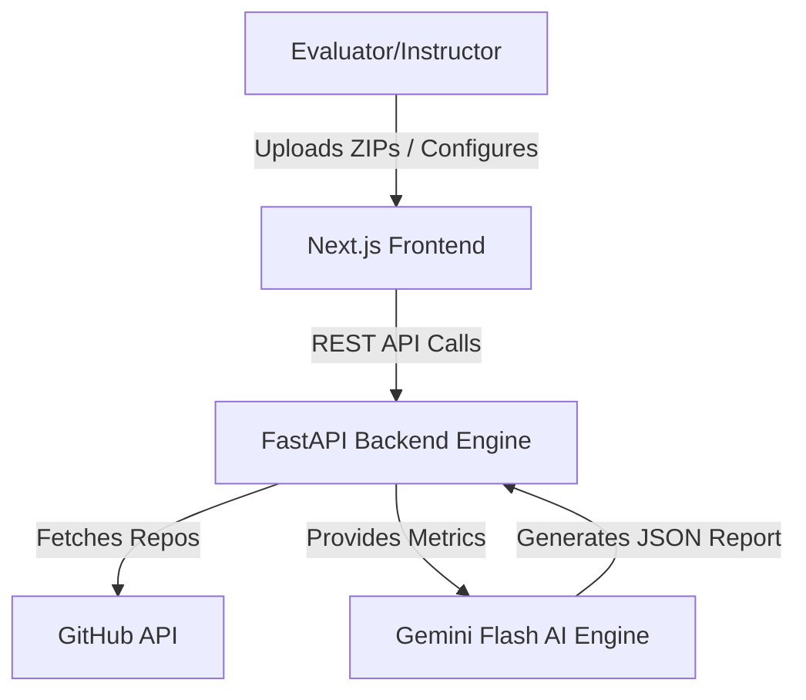
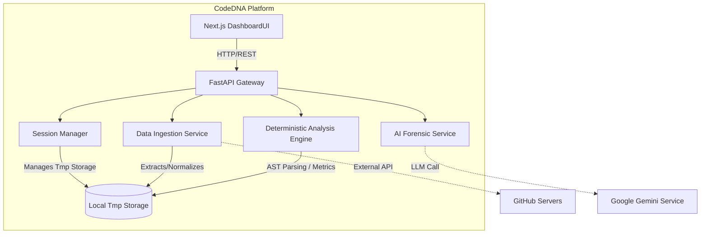
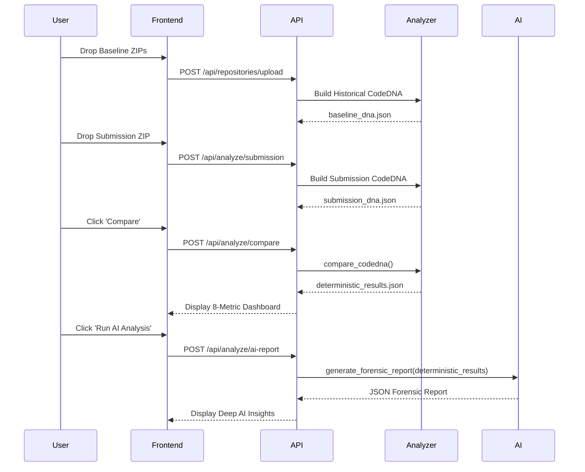

# CodeDNA Architecture & Data Flow

## 1. System Context Diagram (C4 Level 1)

```mermaid
graph TD
    Evaluator[Evaluator/Instructor] -->|Uploads ZIPs / Configures| Frontend
    Frontend[Next.js Frontend] -->|REST API Calls| Backend[FastAPI Backend Engine]
    Backend -->|Fetches Repos| GitHub[GitHub API]
    Backend -->|Provides Metrics| AIEngine[Gemini Flash AI Engine]
    AIEngine -->|Generates JSON Report| Backend
```

## 2. Container Diagram (C4 Level 2)

```mermaid
graph TD
    subgraph CodeDNA Platform
        UI[Next.js DashboardUI] -->|HTTP/REST| API[FastAPI Gateway]
        
        API --> SessionMgr[Session Manager]
        SessionMgr -->|Manages Tmp Storage| Disk[(Local Tmp Storage)]
        
        API --> Ingestion[Data Ingestion Service]
        Ingestion -->|Extracts/Normalizes| Disk
        
        API --> Analysis[Deterministic Analysis Engine]
        Analysis -->|AST Parsing / Metrics| Disk
        
        API --> AI[AI Forensic Service]
    end
    
    Ingestion -.->|External API| GitHub[GitHub Servers]
    AI -.->|LLM Call| Gemini[Google Gemini Service]
```

## 3. Data Flow Diagram

```mermaid
sequenceDiagram
    participant User
    participant Frontend
    participant API
    participant Analyzer
    participant AI
    
    User->>Frontend: Drop Baseline ZIPs
    Frontend->>API: POST /api/repositories/upload
    API->>Analyzer: Build Historical CodeDNA
    Analyzer-->>API: baseline_dna.json
    
    User->>Frontend: Drop Submission ZIP
    Frontend->>API: POST /api/analyze/submission
    API->>Analyzer: Build Submission CodeDNA
    Analyzer-->>API: submission_dna.json
    
    User->>Frontend: Click 'Compare'
    Frontend->>API: POST /api/analyze/compare
    API->>Analyzer: compare_codedna()
    Analyzer-->>API: deterministic_results.json
    API-->>Frontend: Display 8-Metric Dashboard
    
    User->>Frontend: Click 'Run AI Analysis'
    Frontend->>API: POST /api/analyze/ai-report
    API->>AI: generate_forensic_report(deterministic_results)
    AI-->>API: JSON Forensic Report
    API-->>Frontend: Display Deep AI Insights
```
