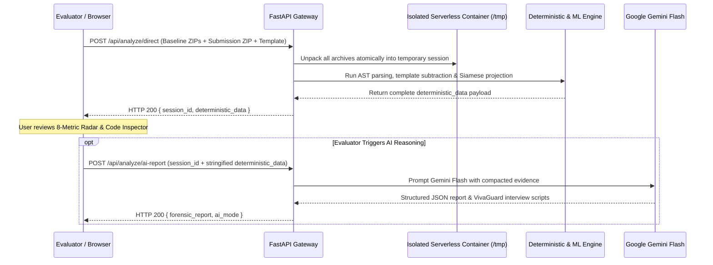
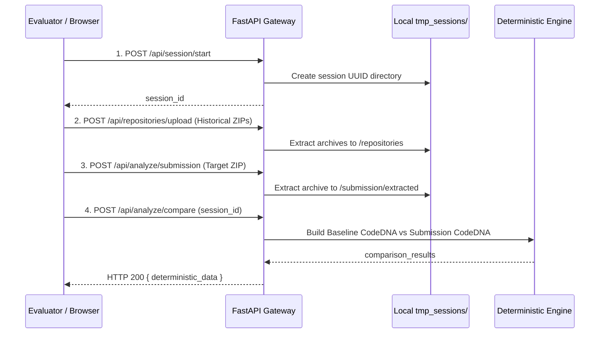

# CodeDNA — System Architecture Specification

> **Document Version:** 2.0  
> **Status:** Production / Evaluator-Ready  
> **Primary Entry Point:** [../README.md](../README.md)  
> **Related Documents:** [PRD.md](PRD.md) | [TRD.md](TRD.md)

---

## 1. System Context Diagram (C4 Level 1)

```mermaid
graph TD
    Evaluator["Academic Evaluator / Integrity Officer"] -->|Uploads ZIPs or GitHub Handles| Workstation["CodeDNA Forensic Workstation (Next.js 16)"]
    Workstation -->|REST API Calls (JSON & Multipart)| Backend["FastAPI Forensic Engine (Python 3.12)"]
    Backend -->|Asynchronous Streaming| GitHub["GitHub REST API"]
    Backend -->|Compacted Structured Evidence Payload| Gemini["Google Gemini Flash LLM Service"]
    Gemini -->|JSON Forensic Report & VivaGuard Scripts| Backend
    Backend -->|Deterministic & AI Synthesis| Workstation
```

---

## 2. Container Architecture (C4 Level 2)

```mermaid
graph TD
    subgraph CodeDNA Platform (Single Vercel Monorepo / Local Host)
        UI["Frontend Single Page App (Next.js 16 / React 19)"]
        
        subgraph Backend API Gateway (FastAPI)
            Router["API Router & Middleware"]
            SessionHandler["Session Storage Manager (/tmp or tmp_sessions)"]
            
            subgraph Analysis & Ingestion Subsystems
                Ingest["Multi-Modal Ingestion Service (ZIP, GitHub, LMS, Template)"]
                Deterministic["Deterministic AST Parser & Deviation Engine (analysis.py)"]
                MLEngine["ML & Calibration Engine (ml_engine/)"]
            end
            
            AIService["Google Gemini Flash Integration Service (ai_engine.py)"]
        end
    end

    UI -->|HTTP /api/analyze/direct| Router
    Router --> SessionHandler
    Router --> Ingest
    Ingest --> Deterministic
    Deterministic --> MLEngine
    Router --> AIService
    AIService -.->|External API Call| GoogleGenAI["Google Gemini Flash API"]
    Ingest -.->|External API Call| GitHubAPI["GitHub REST API"]
```

---

## 3. Data Flow & Execution Pathways

### Pathway A: Atomic Serverless Execution (`POST /api/analyze/direct`)
Optimized for stateless serverless environments (e.g. Vercel Functions) to eliminate ephemeral micro-container storage dropoffs:



### Pathway B: Multi-Step Staged Execution (Localhost Development)
Supports step-by-step staging across distinct client-side interactions:



---

## 4. Core Subsystems & Components

### 4.1 Deterministic AST Parser & Metric Engine (`backend/analysis.py`)
- **AST Explorer:** Parses Python source files into standard `ast.AST` representations, analyzing control flow nodes (`If`, `For`, `While`, `Try`, `With`), abstraction features (`FunctionDef`, `AsyncFunctionDef`, `ClassDef`, `decorator_list`, type annotations), and comprehension expressions.
- **Relative Path Scoping:** Resolves file paths relative to the extraction root (`repo_root`) during `is_usable_file()` filtering. This strictly isolates excluded directory matches (e.g. `tmp`, `temp`, `venv`) to internal project subdirectories, preventing collisions with Linux/Vercel system mounts like `/tmp/codedna_sessions/`.
- **Lexical & Static Heuristics:** Employs regex passes across multi-language codebases (`.js`, `.ts`, `.java`, `.c`, `.cpp`, `.cs`, `.go`, `.rs`) for uniform indentation distribution, comment density, and naming convention classification.
- **Percentile-Based Complexity Distributions:** Calculates P75, P90, median, and mean cyclomatic metrics across all functions to avoid single-outlier distortion.
- **Subtractive Starter Template Filter:** Subtracts identical AST nodes present in the instructor skeleton code before evaluating student variance.

### 4.2 Machine Learning & Calibration Head (`backend/ml_engine/`)
- **Feature Extractor (`feature_extractor.py`):** Normalizes raw AST metrics into a 24-dimensional continuous feature vector bounded in \([0, 1]\).
- **Siamese Projection Head (`siamese_model.py`):** Projects paired baseline-submission representations onto a 24-dimensional normalized hypersphere, calculating latent invariant distance \(d\).
- **Platt Logistic Calibrator (`calibrator.py`):** Converts metric distance into posterior probability \(P(\text{Discontinuity} \mid \text{DNA})\) with 95% confidence intervals.
- **Temporal CUSUM Analyzer (`temporal_analyzer.py`):** Longitudinal change-point detector differentiating natural learning curves from sudden substitution jumps.
- **Cross-Language AST Normalizer (`cross_language_parser.py`):** Applies cognitive invariant discounts when evaluating multi-language transitions (e.g. Python to JavaScript).

### 4.3 AI Forensic Reasoning Engine (`backend/ai_engine.py`)
- **Token Budgeter:** Compacts raw metrics to `<25,000` tokens, ensuring reliable execution on free-tier Gemini API quotas.
- **Model Fallback Chain:** Implements automated fallback across `gemini-2.5-flash`, `gemini-3.5-flash-lite`, and `gemini-1.5-flash` to guarantee high availability.
- **VivaGuard Defense Script Generator:** Produces targeted oral examination questions based directly on flagged anomaly regions.
- **Server-Side Cutoff Protection & In-Flight Lock:** Enforces a server-side availability control (10 October 2026 cutoff date) preventing Gemini API calls starting 11 October 2026, alongside in-flight session deduplication to prevent duplicate concurrent AI executions. Core static CodeDNA analysis operates independently of this AI layer.

### 4.4 Presentation Layer (`frontend/src/`)
- **Interactive Workstation:** 9 modular pipeline views built with Next.js 16, TypeScript, Recharts, and Tailwind CSS.
- **Monotonic Forward Stepper:** Single-direction progressive stage transitions (1 through 4, holding on 5) during analysis polling, eliminating cyclical progress flashing.
- **Syntactic Evidence Inspector:** Split-pane viewer highlighting authentic student code lines associated with flagged anomalies.
- **Formal Case Dossier:** Court-ready A4 document layout with dual export modes (Executive Brief vs Full Extended Dossier) and CSS page-break print optimizations.

---

## 5. Cohort Normalization & Starter Template Engine

### 5.1 Purpose & Core Value
Cohort Normalization eliminates false-positive flags caused by course-wide assignment rules, mandatory framework imports (e.g. PyTorch, FastAPI), or shared instructor starter code. It transitions CodeDNA from 1-dimensional personal comparison to a 2-dimensional matrix evaluating both **Personal Behavioral Drift** and **Cohort Norm Alignment**.

### 5.2 The 3 Ingestion Pathways
- **Master Class ZIP Ingestion (LMS Export):** Unpacks bulk exports from Canvas, Moodle, or Blackboard (`CS101_Submissions.zip`), parses student folders in parallel, and compiles a class baseline (`cohort_baseline.json`) containing P50, P75, P90, and Interquartile Range (IQR) metrics.
- **GitHub Classroom Auto-Fetch:** Asynchronously streams repositories from a GitHub organization (`github.com/cs101-fall2026/assignment-2-*`) into temporary session storage to generate an automated class baseline.
- **Starter Template Subtraction Filter:** Parses an instructor's skeleton starter ZIP and subtracts identical AST nodes, boilerplate imports, and function signatures prior to computing student deviation scores.

### 5.3 Dual-Vector Decision Matrix
$$\text{Adjusted Anomaly Score} = \text{Personal Deviation} \times (1 - \text{Cohort Similarity})$$

| Personal Deviation | Cohort Similarity | Diagnosis | Forensic Output |
| :--- | :--- | :--- | :--- |
| **High** | **High** (Matches Class) | Student followed course template / assignment guidelines. | 🟢 **CLEAR / TEMPLATE NORM** |
| **High** | **Low** (Differs from Class) | Student inserted external code or LLM output unlike peers. | 🔴 **HIGH CONCERN** |
| **Low** | **High** (Matches Both) | Student code matches past work and assignment norm. | 🟢 **CLEAR** |

---

## 6. Forensic Engineering Rationale & Architectural FAQ

- **Gemini Free-Tier 429 Prevention:** Solved via smart payload compacting in `backend/ai_engine.py`. By stripping raw file dumps and summarizing metrics into P75/P90 distributions, total prompt token volume is kept under 25,000 tokens (well below the 250k tokens/min limit).
- **Starter Template Subtraction Semantics:** The Starter Template is an active subtractive filter removing instructor boilerplate, not a standalone baseline. Baseline comparison requires either personal historical archives or a cohort export. Cohort investigations can launch with or without personal baseline ZIPs.
- **Tamper-Evident Dossier Case ID:** Every investigation session generates a cryptographically derived hash identifier (`CASE-` + timestamp/hash) ensuring tamper-evident tracking during formal academic integrity hearings.
- **Reassurance on High Consistency:** When CodeDNA consistency is \(\ge 95\%\), an explicit green verification banner is displayed to confirm genuine authorial match and avoid misinterpreting minor residual style differences.
- **Printable Dossier Engine:** Overhauled with dual-mode toggle (Simple Executive Summary vs Full Extended Audit), rendering evaluated archive names, embedding AI findings, suppressing screen headers, and enforcing signature blocks on the final page.

---

## 7. Architecture Vulnerabilities, Gotchas & Known Risk Matrix

| Risk / Gotcha | Issue & Context | Engineered Mitigation |
| :--- | :--- | :--- |
| **Deprecated Gemini SDK** | `google.generativeai` package is deprecated in favor of `google-genai`. | Migrated import to `from google import genai` and initialized official `client = genai.Client()`. |
| **Model Name Mismatch & High Demand 503s** | Hardcoded model names or peak demand 503s can cause investigation failures. | Configured `GEMINI_MODEL` via `.env` with automatic fallback chain (`gemini-2.5-flash` → `gemini-3.5-flash-lite` → `gemini-1.5-flash`). |
| **Global Python Environment Leak** | Running `pip install` without an activated virtualenv installs packages globally. | Always use `.\venv\Scripts\python.exe -m pip install -r requirements.txt` or equivalent virtualenv binaries. |
| **Multi-Language AST Parity** | Multi-language codebases require standardized AST feature depth across languages. | Implemented `cross_language_parser.py` extracting normalized AST constructs across JS, TS, Java, and C-family languages with cognitive invariant discounts. |
| **Unbounded ZIP Extraction Risk** | Uploading massive `.zip` files can exhaust serverless memory or trigger zip bombs. | Enforced archive size safety checks, maximum file count caps (200 usable files), and 512KB single-file parsing limits in `analysis.py`. |
| **GitHub Rate Limiting** | Unauthenticated requests are capped at 60 req/hr by GitHub's API. | Supported `GITHUB_TOKEN` in `main.py` (increasing limit to 5,000 req/hr) and added frontend HTTP 429 alert cards. |
| **Invalid Baseline GitHub Link** | Non-existent user or unreachable URL can hang while backend awaits response. | Configured 15.0s `httpx` timeouts, client-side regex pre-validation, and instant error card triggers. |
| **Session Volatility (Serverless /tmp)** | Vercel Serverless Functions run in ephemeral microVMs with unshared local disk. | Implemented atomic `POST /api/analyze/direct` endpoint that extracts and evaluates archives in one request, plus stateless `deterministic_data` payloads in AI reporting. |
| **Linux `/tmp` Directory Collision** | Absolute path filtering on Linux/Vercel serverless extracts sessions into `/tmp/...`, accidentally matching `tmp` exclusion patterns and dropping all files. | Scoped directory exclusion checks to relative paths (`Path(filepath).relative_to(repo_root)`), removing top-level `tmp` exclusion collision while preserving student subdirectory filtering. |
| **Cyclic Progress Loader Desync** | Modulo-based interval stepping (`(step + 1) % 4`) causes the progress bar to cycle repeatedly (1-2-3-4-5-2-3-4-5) during long serverless operations. | Replaced cyclical loops with monotonic forward progression (advancing stages 1 to 4 and idling at 5 until request completion). |
| **Wildcard CORS Policy** | Wildcard `allow_origins=["*"]` exposes API to unauthorized cross-origin requests. | Configured `ALLOWED_ORIGINS` environment variable in `backend/main.py` supporting comma-separated origin whitelisting. |
| **Secret Leakage Risk** | Accidental commit of `GEMINI_API_KEY` to public Git repositories. | Kept `.env` strictly in `.gitignore`, provided clean `.env.example` templates, and verified via git tracking audits. |
